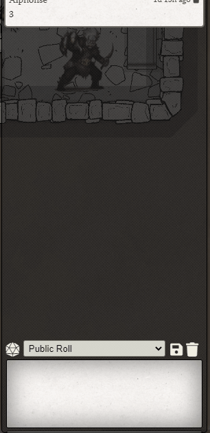

<!--- Downloads @ Latest Badge -->
<!--- replace <user>/<repo> with your username/repository -->
<!---  -->

<!--- Forge Bazaar Install % Badge -->
<!--- replace <your-module-name> with the `name` in your manifest -->
<!---  -->

# FoundryVTT Library: Chat Commands

Allows for easy registration of custom chat commands such as `/command`, complete with autocomplete

The library will handle multiple commands in a single string - if any are marked `shouldDisplayToChat`, then a single chat message is created with all commands stripped.

As of v1.2.0, Core Command autocomplete is included as part of the library



## Include as a dependency in your manifest

```json
{
    "name": "_chatcommands",
    "type": "module",
    "manifest": "https://github.com/League-of-Foundry-Developers/Chat-Commands-Lib/releases/download/1.2.0/module.json"
}
```

# Chat Command class

## commandKey

Type: `string`
The chat command, such as "/command"


## invokeOnCommand

Type: `function`

The function to invoke when the command is matched

Example Function:

```js
function onCommandInvoke(chatlog, messageText, chatData) => {
    console.log("Invoked Command");
});
```

## shouldDisplayToChat

Type: `boolean`
Default: `false`

If true, the command will be removed from the message and the message displayed to chat, such as "/command hi" -> "hi"
If false, no message will be displayed

## createdMessageType

Type: `integer`
Default: `0` (Other)

When `shouldDisplayToChat` is true, the type of message that should be created

## iconClass

Type: `string`
Default: `fa-terminal`

A [Font Awesome](https://fontawesome.com/icons?d=gallery) icon to display in the autocomplete results

## description

Type: `string`
Default: `No description provided`

A string to display in autocomplete results to help a user pick the right command


# Example Usage

```js
Hooks.on("chatCommandsReady", function(chatCommands) {

  // This Command will display the text after the command as well as invoke the method
  chatCommands.registerCommand(chatCommands.createCommandFromData({
    commandKey: "/displaytochat",
    invokeOnCommand: (chatlog, messageText, chatdata) => {
      console.log("Invoked /displaytochat");
      console.log(messageText);
    },
    shouldDisplayToChat: true,
    iconClass: "fa-sticky-note",
    description: "Display to chat"
  }));


  // This will eat the command, displaying nothing to chat, as well as invoke the method
  chatCommands.registerCommand(chatCommands.createCommandFromData({
    commandKey: "/dontdisplaytochat",
    invokeOnCommand: (chatlog, messageText, chatdata) => {
      console.log("Invoked /dontdisplaytochat");
      console.log(messageText);
    },
    shouldDisplayToChat: false,
    iconClass: "fa-sticky-note",
    description: "Don't display to chat"
  }));


  // This uses the optional createdMessageType option to make the created message "Out of Character"
  chatCommands.registerCommand(chatCommands.createCommandFromData({
    commandKey: "/outofcharacter",
    invokeOnCommand: (chatlog, messageText, chatdata) => {
      console.log("Invoked /outofcharacter");
      console.log(messageText);
    },
    shouldDisplayToChat: true,
    createdMessageType: 1,
    iconClass: "fa-sticky-note",
    description: "Posts message OOC"
  }));


  // This modifies the text that will end up in the created message
  chatCommands.registerCommand(chatCommands.createCommandFromData({
    commandKey: "/toupper",
    invokeOnCommand: (chatlog, messageText, chatdata) => {
      console.log("Invoked /toupper");
      messageText = messageText.toUpperCase();
      console.log(messageText);
      return messageText;
    },
    shouldDisplayToChat: true,
    iconClass: "fa-sticky-note",
    description: "Uppercases text"
  }));

});
```

## Changelog

### v1.0.0

* Initial release

### v1.1.0

* Deprecated `createCommand(commandKey, shouldDisplayToChat, invokeOnCommand, createdMessageType = 0)` in favor of `createCommandFromData(data)`
* Added autocomplete for commands (on by default, client setting)
* Added IconClass
* Added Description

### v1.2.0

* Added Core Command autocomplete
